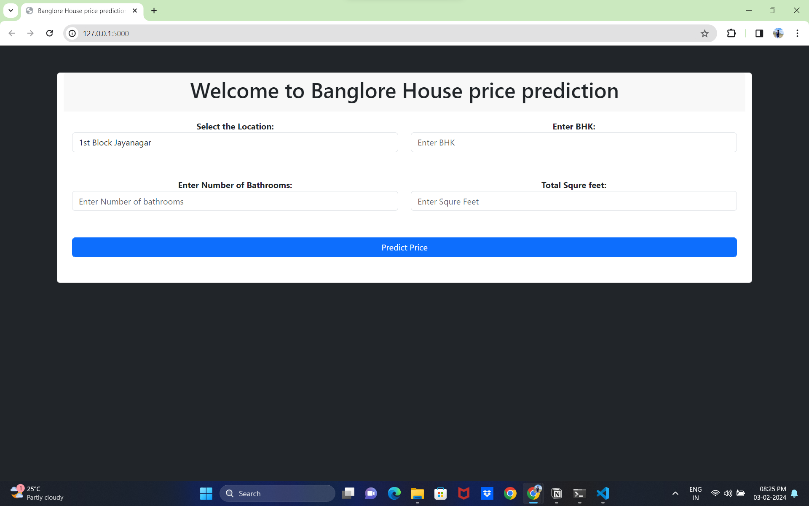
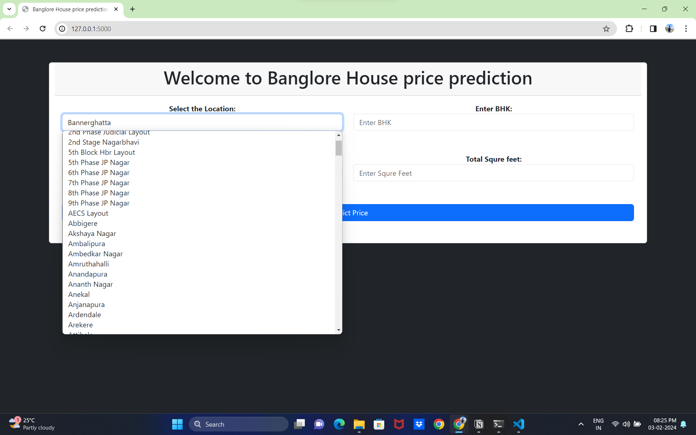
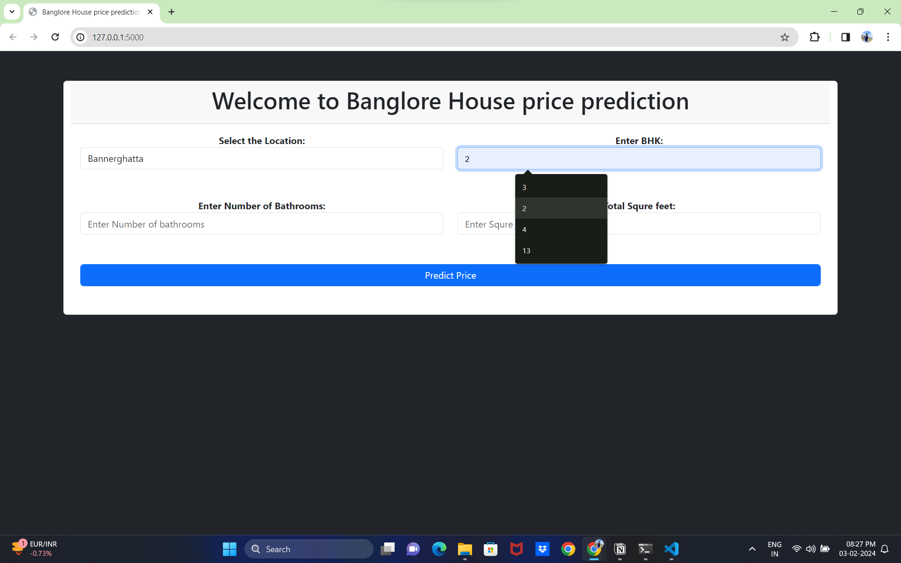
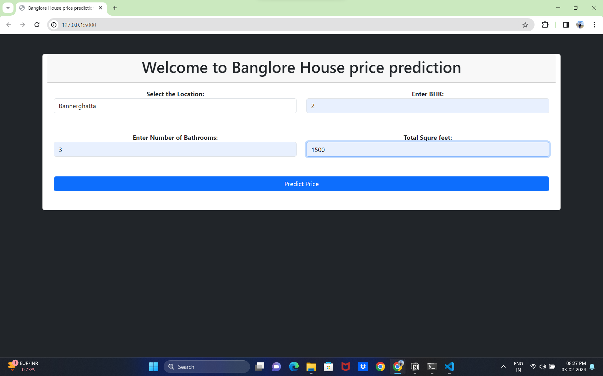
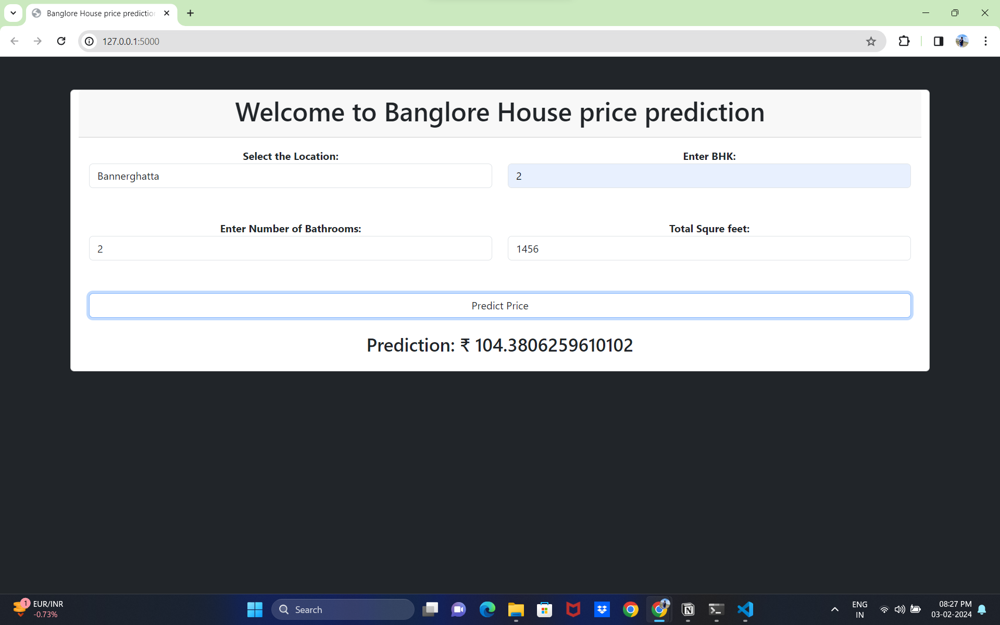

# Data Science

Welcome to my "Data Science Project" repository! 🚀

In this repository, I'm sharing my all project source code with some explaination , feel free to check out my code and if u have any suggestion or doubt u can connect with me on my linkdln profil www.linkedin.com/in/tejas-kharde-847347226 

### Notion Website published:
For more documentation and get get step by step detail explaination about this project visite my notion wesite Here :

[Bengaluru house price Dataset](https://www.kaggle.com/amitabhajoy/bengaluru-house-price-data)

### **A.Overview:**
- This project, we have build a machine learning model to predict the house prices of Indian city ( Bengaluru)
- This project will very helpful for the real estate market. 
- The Bangaluru House Prediction System is a web-based application that predicts house prices in Bangalore based on various features and parameters.
-  The system utilizes a machine learning model to provide accurate and insightful predictions. The front-end of the application is built using Flask, HTML, and CSS, ensuring a user-friendly and intuitive experience.
    

### **B.Model Implementation:**
1. **Feature Selection:**
    - Identification and selection of relevant features from the dataset to build an effective predictive model. Unnecessary or redundant features are excluded to streamline the model.
2. **Data Cleaning:**
    - The process of handling missing values and outliers within the dataset. This step ensures the integrity of the data and improves the model's robustness.
3. **Feature Engineering:**
    - Transformation of existing features or creation of new ones to enhance the model's predictive power. It often involves converting categorical data, handling variations, and deriving meaningful insights from the available features.
4. **Adding New Features - Price per Sqft:**
    - Calculation of a new feature, 'price_per_sqft,' which provides a standardized metric for comparing house prices based on their total square footage.
5. **Examine Location Column:**
    - Analysis of the 'location' column to handle less frequent locations and create a more manageable and informative categorical feature.
6. **Removing Outliers:**
    - Elimination of data points that deviate significantly from the majority, ensuring a more accurate representation of the dataset and improving model performance.
7. **Drop Unwanted Columns:**
    - Removal of unnecessary columns to simplify the dataset and focus on the most relevant information for predicting house prices.
8. **Applying get_dummies and Preparing Data for Model Building:**
    - Transformation of categorical variables into numerical representations using techniques like one-hot encoding. This prepares the data for input into machine learning models.
9. **Applying Cross-Validation and GridSearchCV:**
    - Utilization of cross-validation techniques and grid search to fine-tune model parameters, ensuring optimal performance and generalizability.
12. **Predicting Price Using User Input:**
    - Creation of a function to predict house prices based on user-provided inputs, including location, square footage, number of bathrooms, and bedrooms.
13. **Dumping Model Using Pickle:**
    - Serialization of the trained model using the 'pickle' module, allowing for easy storage and reuse of the model for future predictions.

## **C.Front-end Interface:**

- The code structure utilizes Flask for the backend, connecting with a machine learning model to predict house prices. It incorporates data loading using Pandas, model loading through pickle, and features two main routes.

- The Index Route ("/"): renders the HTML template, fetching unique location values for the dropdown. The Predict Route ("/predict"): listens for POST requests, collects user input, calls the predict_price function, and returns the predicted house price.

- The predict_price function processes user inputs, prepares an input array using the loaded model and column names, and predicts the house price. The Flask app runs in debug mode, facilitating interaction between users and the predictive model through a user-friendly front-end interface.

## **Instructions for Running the Project:** 

1. Clone the repository to your local machine.
2. Install the required dependencies (provide details on dependencies).
3. Run the Flask application using the command **[python app.py]** .
4. Open your web browser and navigate to the provided local host link (usually http://localhost:5000).

**Happy Learning!** 🐍🤖
