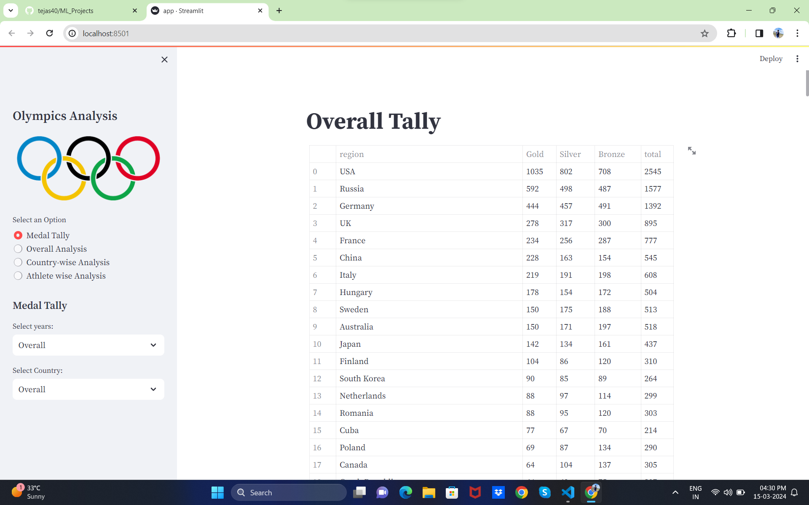
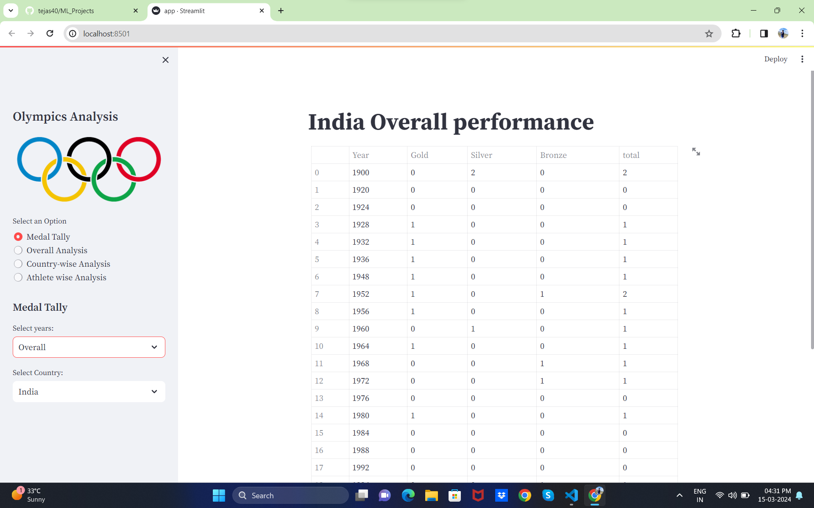
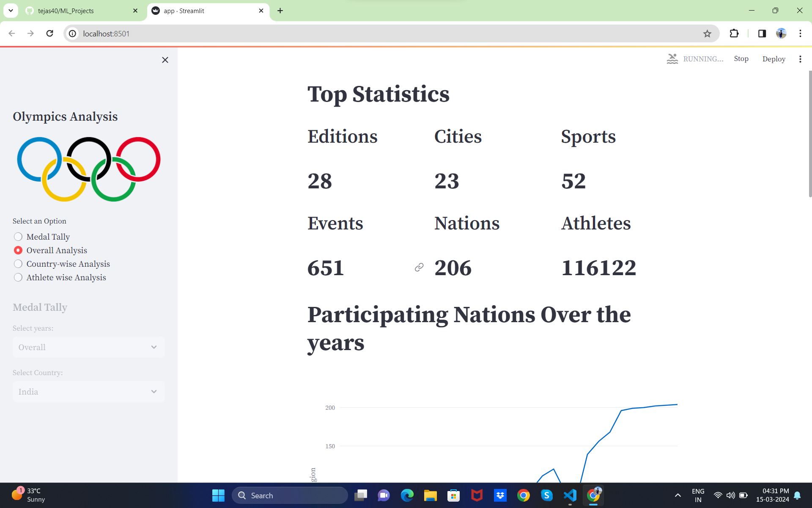
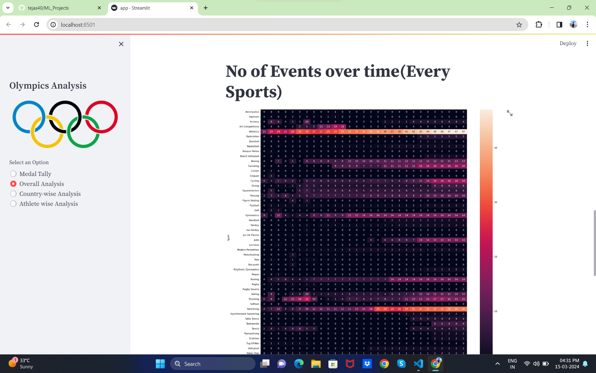
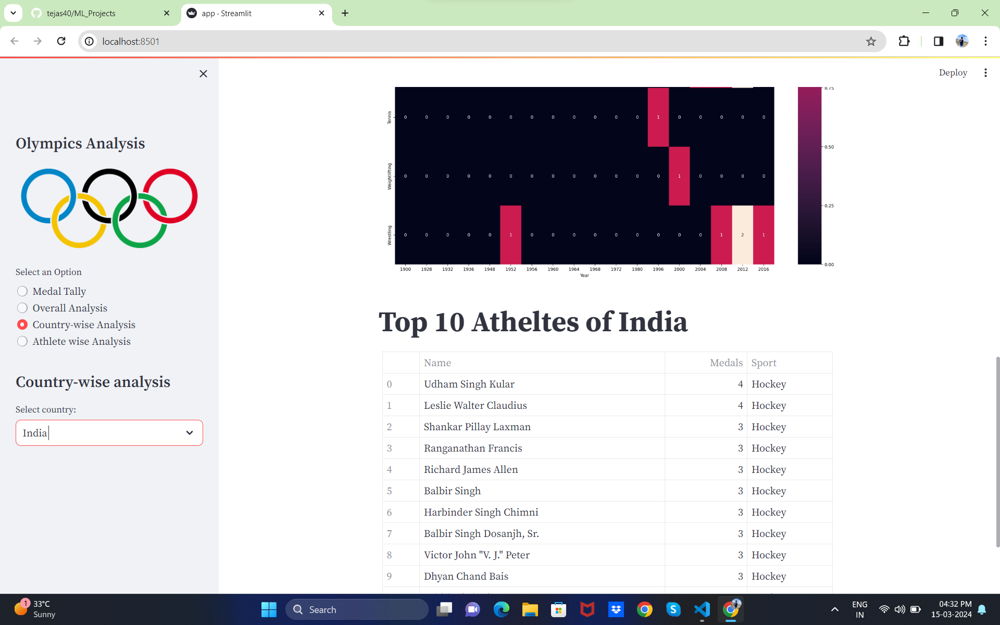
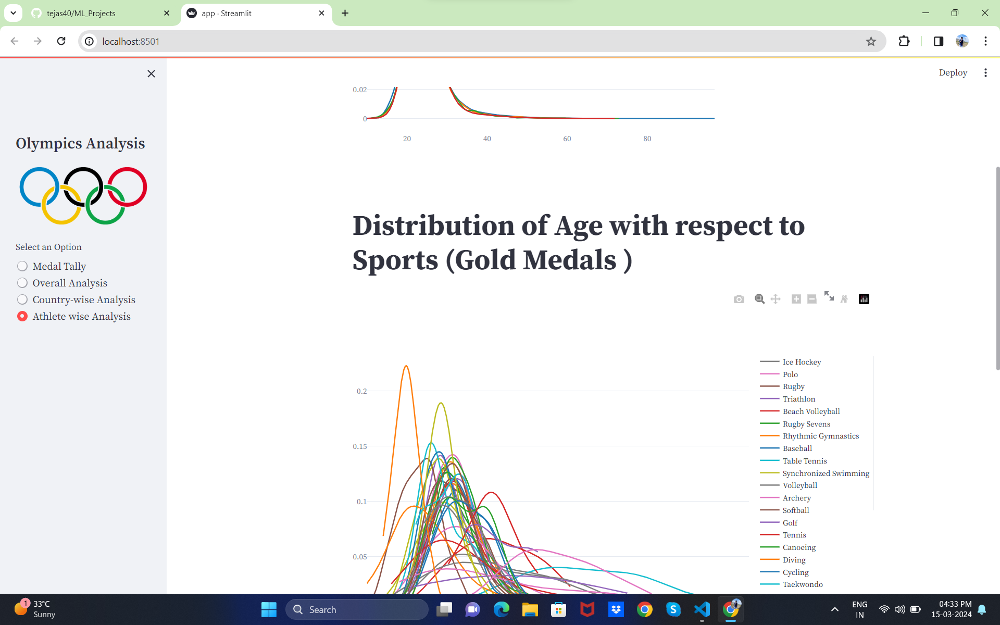
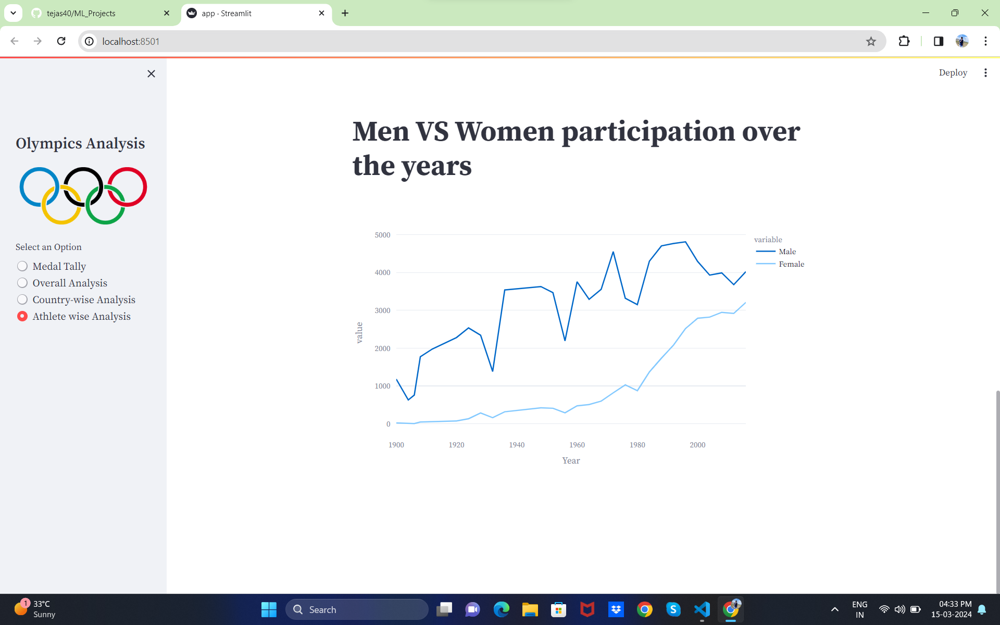

# Data Science

Olympic Data analysis and Created Web application 

In this repository, I'm sharing my all project source code with some explaination , feel free to check out my code and if u have any suggestion or doubt u can connect with me on my [linkdln profil](www.linkedin.com/in/tejas-kharde-847347226)

### Notion Website published:
For more documentation and get get step by step detail explaination about this project visite my notion wesite Here : [NOtion Page](https://tejaskharde.notion.site/ML_Notes-79277ea3a9304509861b4fb692d78a0d?pvs=4)

### **A.Overview:**

- This project aims to create an end-to-end movie recommendation system using the TMDB 5000 Movie Dataset.
- The system incorporates Exploratory Data Analysis (EDA) to understand the dataset's characteristics and patterns, followed by the development of a recommendation model.
- Additionally, a user-friendly front-end interface has been implemented to enhance the user experience.
- DATASET For our project:
    
    [120 year of olympic histroy ](https://www.kaggle.com/datasets/heesoo37/120-years-of-olympic-history-athletes-and-results)
    

### **B.Model Implementation:**

## **Instructions for Running the Project:** 

1. Clone the repository to your local machine.
2. Install the required dependencies (provide details on requirement file).
3. Run the app.py type this command in cmd (streamlit run app.py)
4. Above command Launch the front-end interface on Streamlit server.
6. Explore  all analysis report in web application.

 

**Happy Learning!** 🐍🤖
